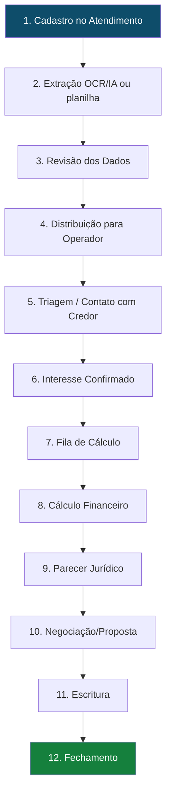

# Ciclo de Vida do Precatório

## Fluxo Completo

## Status do Precatório

| Status         | Descrição                                     |
| -------------- | --------------------------------------------- |
| `novo`         | Recém cadastrado, aguardando distribuição     |
| `em_andamento` | Atribuído, em processo                        |
| `em_calculo`   | Na fila de cálculo ou sendo calculado         |
| `calculado`    | Cálculo concluído, aguardando próximos passos |
| `concluido`    | Processo finalizado                           |

## Etapa 1 — Cadastro no Atendimento

- Rota: `/atendimento`
- O `admin` cadastra manualmente ou importa em lote os créditos originados para triagem.
- O crédito já nasce com `origem = atendimento` e `status_atendimento = na_fila`.
- O cadastro não acontece mais em `/admin/precatorios`.

## Etapa 2 — Extração OCR/IA

> [!info] Pipeline OCR
> Usa **Google Gemini** para extrair campos automaticamente de documentos PDF.

- Upload de documentos na aba "Documentos" do precatório
- Pipeline em `lib/server/nova-pipeline-ocr.ts`
- Cada campo extraído recebe um **score de confiança** (0-100) e nível (`alta`/`media`/`baixa`)
- Conflitos entre fontes são detectados automaticamente
- Resultado salvo em `precatorio_extracao` + `precatorio_extracao_campo`

## Etapa 3 — Revisão dos Dados

- Operador revisa campos extraídos vs. documentos originais
- Pode aprovar ou sobrescrever valores com confiança baixa
- Checklist de documentos rastreia o que foi recebido

## Etapa 4 — Distribuição

> [!warning] Redistribuição
> Somente `admin` pode redistribuir precatórios já atribuídos.
> Requer dois passos (clear → set) por restrição de RLS.

- No atendimento, o `admin` distribui o crédito diretamente para o operador antes de sair da área.
- Em importações grandes, a distribuição pode ser balanceada automaticamente por `valor_principal`.
- Define: `dono_usuario_id`, `responsavel`, `responsavel_calculo_id`, prioridade
- Registra: `distribuido_por_admin`, `distribuido_por_admin_id`, `distribuido_por_admin_em`

## Etapa 5 — Triagem / Contato com Credor

- Rota: `/atendimento`
- `agente_atendimento` vê toda a fila sem valores.
- `operador_comercial` e `operador` veem apenas os próprios créditos distribuídos, também sem valores.
- Só `admin` vê os valores dentro da aba de atendimento.
- Quando há interesse, o crédito sai da triagem e volta ao fluxo principal.

## Etapa 6 — Fila de Cálculo

- Rota: `/calculo`
- Role: `operador_calculo`
- Precatório aparece com status `em_calculo`
- SLA começa a contar a partir de `data_entrada_calculo`

## Etapa 7 — Cálculo Financeiro

Veja [[Fluxo de Cálculo]] para detalhes completos.

Resumo dos modelos:
- **Modelo A** (pré-2022): IPCA-E cumulativo + juros
- **Modelo B** (2022-2024): IPCA-E + SELIC EC113
- **Modelo C** (2025+): IPCA-E 2025

Deduções aplicadas:
1. PSS (por faixas de valor)
2. IRPF (com meses de competência)
3. Honorários contratuais
4. Adiantamentos recebidos

## Etapa 8 — Parecer Jurídico

- Rota: `/parecer-juridico`
- Role: `juridico`
- Análises: penhora, cessão, herdeiros, viabilidade
- Resultado: `viavel` / `inviavel` / `pendente`
- Após aprovação jurídica, precatório libera para negociação

## Etapa 9 — Negociação/Proposta

- Rota: `/propostas`
- Duas propostas geradas: menor e maior percentual
- Negociação registrada via RPC `registrar_negociacao_proposta`
- Histórico salvo em tabela `proposta`

## Etapa 10 — Escritura

- Rota: `/gestao-escrituras`
- Role: `gestor_escrituras`
- Status da escritura: `nao_iniciado` → `em_andamento` → `pendente_assinatura` → `concluido`
- Geração automática disponível via `/api/gerar-escritura`

## Etapa 11 — Fechamento

- Status final: `concluido`
- Timeline e atividades registradas ao longo de todo o ciclo
- Dados preservados em `atividade` e `timeline_precatorios`

## SLA e Atrasos

| Campo `sla_status` | Significado |
|--------------------|-------------|
| `nao_iniciado` | Ainda não entrou no cálculo |
| `no_prazo` | Dentro do prazo |
| `atencao` | Prazo próximo |
| `atrasado` | SLA estourado |
| `concluido` | Finalizado |

Causas de atraso (`tipo_atraso`): documentação pendente, aguardando resposta, complexidade alta, etc.

## Veja também
- [[Setor de Atendimento]]
- [[Fluxo de Cálculo]]
- [[Módulo Admin]]
- [[Tabelas Principais]]
- [[Papéis e Permissões]]
