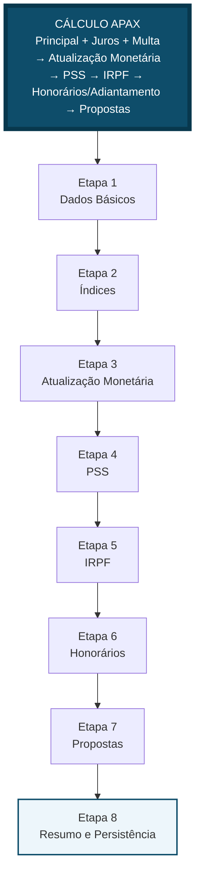

# Fluxo de Cálculo

> [!abstract] Fonte de verdade operacional
> Esta nota descreve o fluxo de cálculo da calculadora do CRM APAX passo a passo. Ela é usada como base de consulta pelos agentes e também alimenta o painel lateral `Guia do cálculo` dentro da calculadora.

> [!info] Vista visual no Obsidian
> Abra [[Mapa Visual do Cálculo.canvas|Mapa Visual do Cálculo]] para enxergar o nó mestre do cálculo, as etapas em sequência e os blocos explicativos separados. O canvas aponta para esta própria nota, então a edição aqui repercute na visualização do vault e no guia lateral da calculadora.

## Visão Operacional

O cálculo atual do projeto segue uma cadeia fixa: o operador informa a base financeira, o sistema consulta índices e recortes normativos, a engine monta a atualização monetária, aplica PSS e IRPF, calcula honorários e adiantamentos, gera propostas e fecha o resultado final. A tela ativa hoje possui **8 etapas**; o upload de documentos existe, mas fica como ação lateral no drawer e não como etapa da calculadora.

## Nó Mestre do Cálculo

### Nó central

Cálculo APAX do Precatório

### Fórmula de leitura

- Valor base composto = `principal_informado + juros_informados + multa_informada`
- Valor atualizado final = `valorCorrigido + valorJurosPre22 + valorSelic + correcaoIPCA2025`
- Base líquida final = `valorAtualizadoFinal - PSS - IRPF - honorários - adiantamento`
- Propostas = `base líquida final × percentuais configurados`

### Objetivo

Representar, em um único nó, a forma como o sistema sai dos valores informados no ofício e chega ao valor líquido e às propostas que serão usadas na operação.

### Ordem lógica

- Consolidar principal, juros e multa logo na entrada.
- Calcular os índices aplicáveis ao período.
- Rodar a engine de atualização monetária.
- Aplicar PSS.
- Aplicar IRPF.
- Aplicar honorários e adiantamentos.
- Gerar menor e maior proposta.
- Revisar, exportar e persistir o cálculo.

### Alertas

- A calculadora em produção usa **8 etapas**, não 9.
- O upload de documentos é ação lateral, não etapa formal.
- Alterações nesta nota atualizam o guia informativo da calculadora, mas não substituem alterações no código da engine.

## Etapa 1 — Dados Básicos

Aqui o operador define a base financeira mínima e os dados orçamentários que sustentam todo o restante do fluxo.

### Objetivo

Capturar o valor principal, juros, multa, data base e sinais da análise processual antes de qualquer cálculo de índice ou desconto.

### Entradas

- `valor_principal_original`
- `valor_juros_original`
- `multa`
- `data_base`
- `loa`
- `ano_orcamentario`
- `previsao_pagamento`
- observações da análise processual já carregadas do precatório

### Operações

- Somar principal, juros e multa para produzir a base financeira composta.
- Preservar os valores originais em `principal_informado`, `juros_informados` e `multa_informada`.
- Reescrever `valor_principal_original` com a soma consolidada que será enviada à engine.

### Saídas

- payload consolidado da etapa
- base composta pronta para a Etapa 2
- dados auxiliares para auditoria fiscal e financeira

### Explicações separadas

- Esta etapa é onde o sistema decide que a engine trabalhará sobre a soma principal + juros + multa.
- As observações da análise processual não calculam nada aqui, mas influenciam decisões futuras em honorários, adiantamentos, cessão, herdeiros e ITCMD.
- A data base alimenta tanto a consulta de índices quanto a lógica de corte normativo da engine.

### Código relacionado

- `components/steps/step-dados-basicos.tsx`
- `components/calculador-precatorios.tsx`

## Etapa 2 — Índices e corte normativo

Esta etapa traduz a data base e a data final em fatores e percentuais prontos para a engine.

### Objetivo

Definir quais blocos normativos incidem sobre o cálculo e entregar os fatores necessários para IPCA, SELIC e IPCA 2025.

### Entradas

- `data_base`
- `data_final_calculo`
- `TABELA_IPCA_FATORES_EC113`
- `TABELA_SELIC_PERCENTUAL_EC113`
- `IPCA_E_MENSAL`
- `TABELA_INDICES_COMPLETA`

### Operações

- Calcular `dados_ipca` quando a data base estiver antes de dezembro de 2021.
- Somar `dados_selic` quando o período cruzar janeiro de 2022 até dezembro de 2024.
- Somar `dados_ipca_2025` quando a data base for igual ou posterior a janeiro de 2025.
- Persistir `ipca_fator_inicial`, `ipca_fator_final` e `selic_acumulada_percentual`.

### Saídas

- `dados_ipca`
- `dados_selic`
- `dados_ipca_2025`
- `ipca_fator_inicial`
- `ipca_fator_final`
- `selic_acumulada_percentual`

### Explicações separadas

- Esta etapa não altera o valor do precatório; ela só prepara os insumos oficiais para a engine.
- O recorte normativo é feito pela data base e não pelo valor do crédito.
- O IPCA 2025 é somado mês a mês até a data atual do sistema.

### Código relacionado

- `components/steps/step-indices.tsx`
- `lib/calculos/dados-ec113.ts`
- `lib/calculos/indices.ts`

## Etapa 3 — Atualização Monetária

A engine é executada em modo de prévia e expõe a memória do cálculo para a UI.

### Objetivo

Produzir o valor atualizado bruto com memória de cálculo explícita para IPCA/IPCA-E, juros pré-2022, SELIC pós-2022 e EC 136/2025.

### Entradas

- base composta da Etapa 1
- índices e fatores da Etapa 2
- `data_base`
- `data_final_calculo`

### Operações

- Chamar `calcularPrecatorio()` com os dados consolidados.
- Montar `memoriaCalculo.ipca`, `memoriaCalculo.juros`, `memoriaCalculo.selic` e `memoriaCalculo.ipca2025`.
- Exibir um detalhamento auditável para o operador antes de prosseguir.

### Saídas

- `valor_atualizado`
- `valorJuros`
- `valorSelic`
- `juros_mora`
- `taxa_juros_mora`
- `memoriaCalculo`

### Explicações separadas

- O cálculo bruto final é a soma do valor corrigido por IPCA com os blocos adicionais de juros pré-2022, SELIC e EC 136/2025.
- A UI usa a memória da engine para mostrar como o número foi formado.
- A partir daqui, as etapas seguintes passam a tratar apenas deduções e distribuição.

### Código relacionado

- `components/steps/step-atualizacao-monetaria.tsx`
- `lib/calculos/calcular-precatorio.ts`

## Etapa 4 — PSS

O sistema decide se o PSS será isento, manual ou automático.

### Objetivo

Aplicar o desconto de PSS com base no valor do ofício, nos fatores calculados e nas regras auxiliares da engine.

### Entradas

- `pss_oficio_valor`
- `isento_pss`
- `pss_manual`
- índices produzidos na Etapa 2
- valor atualizado bruto produzido na Etapa 3

### Operações

- Se isento, zerar o desconto.
- Se manual, usar `pss_valor` informado.
- Se automático com valor de ofício, recalcular PSS corrigido por IPCA, SELIC e IPCA 2025.
- Na engine, se não houver valor de ofício, usar a lógica de faixas progressivas por salários mínimos.

### Saídas

- `pss_valor`
- `pssTotal`
- `pss_atualizado`
- `tem_desconto_pss`

### Explicações separadas

- A UI prioriza o valor do ofício como base do PSS atualizado.
- A engine mantém um fallback por faixas para cenários sem valor de ofício.
- O resultado desta etapa já entra diretamente na base líquida usada depois em honorários e propostas.

### Código relacionado

- `components/steps/step-pss.tsx`
- `lib/calculos/calcular-precatorio.ts`

## Etapa 5 — IRPF

Esta etapa audita e calcula o IRPF de acordo com o regime RRA e com o tipo de beneficiário.

### Objetivo

Definir o imposto devido com base nas regras fiscais do credor ou do advogado, preservando opção de isenção e override manual.

### Entradas

- `meses_execucao_anterior`
- `tipo_beneficiario`
- `irpf_manual`
- `irpf_isento`
- principal consolidado
- memória da atualização monetária

### Operações

- Na UI, montar uma auditoria simplificada com base em principal + correção monetária.
- Na engine final, para beneficiário comum, calcular base usando principal + correção IPCA + SELIC + EC 136/2025.
- Na engine final, para advogado, usar principal + juros + multa.
- Aplicar faixa RRA, parcela dedutível e meses de execução.

### Saídas

- `valor_irpf`
- `irTotal`
- `irpf_valor`
- `audit_snapshot`

### Explicações separadas

- A UI mostra uma trilha de auditoria para o operador entender a faixa aplicada.
- O cálculo definitivo acontece na engine, não apenas no preview da etapa.
- O tipo de beneficiário muda a composição da base tributável.

### Código relacionado

- `components/steps/step-irpf.tsx`
- `lib/calculos/calcular-precatorio.ts`

## Etapa 6 — Honorários e Adiantamentos

Depois dos tributos, o sistema calcula os descontos negociais sobre a base líquida prévia.

### Objetivo

Transformar percentuais de honorários e adiantamentos em descontos efetivos sobre a base líquida após PSS e IRPF.

### Entradas

- `honorarios_percentual`
- `adiantamento_percentual`
- `honorarios_manual`
- total bruto da Etapa 3
- PSS da Etapa 4
- IRPF da Etapa 5
- observações da análise processual

### Operações

- Calcular `basePreDescontos = totalBruto - PSS - IRPF`.
- Aplicar percentuais automaticamente quando o modo manual estiver desligado.
- Permitir valores manuais para honorários e adiantamento quando necessário.

### Saídas

- `honorarios_valor`
- `adiantamento_valor`
- `honorarios_percentual`
- `adiantamento_percentual`

### Explicações separadas

- Esta etapa não recalcula tributos; ela consome o líquido parcial vindo das etapas anteriores.
- O modo manual substitui os valores em reais, mas a etapa ainda preserva percentuais ajustados para a persistência.
- Observações processuais como cessão, herdeiros e ITCMD podem alterar a decisão humana desta etapa.

### Código relacionado

- `components/steps/step-honorarios.tsx`

## Etapa 7 — Propostas

Com o valor líquido final definido, a calculadora gera as propostas e, quando existir herdeiro, prepara a distribuição de cotas.

### Objetivo

Gerar menor e maior proposta com base na base líquida final e suportar override manual ou rateio entre herdeiros.

### Entradas

- base líquida final
- percentuais da menor e maior proposta
- `propostas_manual`
- herdeiros em `precatorio_herdeiros`

### Operações

- Montar `base_liquida_final = totalBruto - PSS - IRPF - honorários - adiantamento`.
- Calcular menor e maior proposta por percentual quando o modo automático estiver ativo.
- Permitir valores manuais de proposta quando o modo manual estiver ativo.
- Validar que a soma das cotas de herdeiros feche em 100%.

### Saídas

- `base_liquida_final`
- `menor_proposta`
- `maior_proposta`
- `qtdSalariosMinimos`

### Explicações separadas

- As propostas não usam mais o bruto; elas usam a base líquida final.
- O rateio entre herdeiros é controlado nesta etapa, mas salvo em tabela própria.
- Esta etapa já deixa pronto o preview completo do breakdown usado no resumo.

### Código relacionado

- `components/steps/step-propostas.tsx`
- `components/kanban/proposal-config-modal.tsx`

## Etapa 8 — Resumo e Persistência

O operador revisa tudo, pode exportar o JSON e finaliza o cálculo gravando histórico e versão.

### Objetivo

Consolidar bruto, descontos, propostas e persistir a versão final do cálculo no banco.

### Entradas

- resultado da Etapa 7
- dados de todas as etapas anteriores
- `precatorioId`

### Operações

- Exibir composição final do cálculo.
- Permitir exportação do payload em JSON.
- Atualizar `precatorios` com campos financeiros e `dados_calculo`.
- Inserir nova versão em `precatorio_calculos`.
- Registrar atividade em `atividades`.

### Saídas

- `precatorios.valor_atualizado`
- `precatorios.saldo_liquido`
- `precatorios.menor_proposta`
- `precatorios.maior_proposta`
- `precatorios.dados_calculo`
- `precatorio_calculos.versao`

### Explicações separadas

- Esta é a única etapa que fecha o fluxo e materializa o resultado no banco.
- O JSON exportado é um snapshot do cálculo, útil para auditoria e conferência.
- O histórico de versões é o que permite recalcular e rastrear mudanças depois.

### Código relacionado

- `components/steps/step-resumo.tsx`
- `components/calculador-precatorios.tsx`
- `lib/calculos/calcular-precatorio.ts`

## Ações laterais fora do fluxo principal

- Upload de PDF e visualização de documentos no drawer lateral.
- Painel `Guia do cálculo`, que lê esta nota em tempo real.
- Reset completo do cálculo com limpeza de `dados_calculo` e `pdf_url`.

## Regras da Engine

### Atualização monetária

- Modelo A: data base anterior a janeiro de 2022, com razão de fatores IPCA e juros pré-2022.
- Modelo B: janela de janeiro de 2022 a dezembro de 2024, com SELIC acumulada mensal.
- Modelo C: janeiro de 2025 em diante, com soma do IPCA-E mensal da EC 136/2025.
- A composição final da atualização sempre soma os blocos aplicáveis ao período.

### PSS

- Se houver `pss_valor` manual, esse valor prevalece.
- Se houver `pss_oficio_valor`, a UI calcula PSS corrigido com IPCA, SELIC e IPCA 2025.
- Sem valor de ofício, a engine pode cair para cálculo por faixas progressivas em salários mínimos.

### IRPF

- Para beneficiário comum, a engine usa principal + correção monetária + SELIC + EC 136/2025.
- Para advogado, a base usada muda para principal + juros + multa.
- A quantidade de meses da execução influencia a faixa RRA e a parcela dedutível total.

### Persistência e histórico

- O cálculo final atualiza o registro principal do precatório.
- Cada finalização gera uma nova linha em `precatorio_calculos`.
- O snapshot completo fica em `dados_calculo`.

## Fórmulas de Fechamento

### Valor base composto

- `valorPrincipalParaCalculo = principal_informado + juros_informados + multa_informada`

### Valor atualizado final

- `valorAtualizadoFinal = valorCorrigido + valorJurosPre22 + valorSelic + correcaoIPCA2025`

### Base líquida final

- `baseLiquidaFinal = valorAtualizadoFinal - PSS - IRPF - honorarios - adiantamento`

### Propostas

- `menorProposta = baseLiquidaFinal × percentualMenor`
- `maiorProposta = baseLiquidaFinal × percentualMaior`
- `modo manual = valores informados substituem os percentuais`

## Diferenças entre UI e Engine

- A UI ativa tem 8 etapas; referências antigas a 9 passos estão desatualizadas.
- O upload de documentos não é etapa formal; ele mora no drawer lateral.
- A prévia da Etapa 5 é uma auditoria simplificada; o cálculo final de IRPF é fechado na engine.
- `valor_principal_original` é reescrito como base composta depois da Etapa 1, mas os valores originais continuam guardados em campos auxiliares.

## Sincronização com Obsidian

- Esta nota é lida em tempo real por `app/api/knowledge/calculo-flow/route.ts`.
- O painel lateral `Guia do cálculo` da calculadora renderiza o conteúdo desta nota sem duplicar texto no frontend.
- O canvas `[[Mapa Visual do Cálculo.canvas|Mapa Visual do Cálculo]]` usa esta mesma nota como fonte, por meio de nós de arquivo apontando para os headings relevantes.
- Alterações aqui atualizam explicações, etapas, fórmulas e alertas exibidos na calculadora.
- Alterações aqui não mudam automaticamente a matemática da engine; mudanças de regra financeira exigem atualização correspondente em `lib/calculos/`.

## Veja também
- [[Mapa Visual do Cálculo.canvas|Mapa Visual do Cálculo]]
- [[Calculadora de Precatórios]]
- [[Ciclo de Vida do Precatório]]
- [[Tabelas Principais]]
