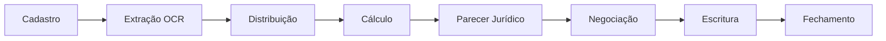

# Visão Geral do Sistema

## O que é

Sistema CRM para gestão completa do ciclo de vida de **precatórios judiciais** — desde o cadastro e extração de dados por OCR/IA, passando pelo cálculo financeiro (IPCA-E, SELIC, PSS, IRPF), até a negociação, escritura e fechamento.

## Módulos Principais

| Módulo | Rota | Papéis principais |
|--------|------|-------------------|
| Dashboard | `/dashboard` | Todos |
| Precatórios | `/precatorios` | Todos |
| Fila de Cálculo | `/calculo` | operador_calculo |
| Calculadora | `/calcular` | operador_calculo |
| Kanban | `/kanban` | gestor, juridico |
| Propostas | `/propostas` | comercial, gestor |
| Parecer Jurídico | `/parecer-juridico` | juridico |
| Certidões | `/gestao-certidoes` | gestor_certidoes |
| Ofícios | `/gestao-oficios` | gestor_oficio |
| Escrituras | `/gestao-escrituras` | gestor_escrituras |
| Atendimento | `/atendimento` | agente_atendimento |
| Admin | `/admin/*` | admin, tecnico_ti |

## Stack Tecnológica

### Frontend
- **Framework**: Next.js 15.5 (App Router)
- **UI**: HeroUI v3 + Radix UI + Apax Clay Design System
- **Estilos**: Tailwind CSS 4
- **Animações**: Framer Motion, GSAP, Three.js
- **Gráficos**: Recharts
- **Fonte**: Plus Jakarta Sans

### Backend
- **BaaS**: Supabase (PostgreSQL + Auth + Storage + Realtime)
- **APIs**: Next.js API Routes
- **AI/OCR**: Google Gemini (extração de documentos)
- **Dados externos**: BCB (CDI/Selic), Tesouro Transparente, DataJud

### Acesso
- **Canal oficial**: Web (Google Chrome)
- **Notificações**: Web Notifications API + fallback em toast no app

## Design System — Apax Clay

> [!info] Apax Clay
> Design system proprietário com visual "clay" (argila) caracterizado por:
> - **4 camadas de sombra**: outer highlight, outer shadow, inner highlight, inner shadow
> - **Cor primária**: azul petróleo `#0e4d6a`
> - **Cards**: `rounded-[22px]` com `boxShadow` clay característico
> - **Inputs**: inset shadow suave, sem bordas agressivas
> - Sem emojis, sem shadcn Card/Button/Input nativos

## APIs Externas

| API | Uso | Cache |
|-----|-----|-------|
| BCB (`api.bcb.gov.br`) | Taxas CDI, SELIC | 1h (ISR) |
| Tesouro Transparente | Títulos do Tesouro | 1h (ISR) |
| DataJud | Consulta processual | 20s timeout, sem cache |
| Google Gemini | OCR e extração | Por documento |
| OpenAI (`gpt-4o-mini`) | Reescrita de comunicados | Por chamada |

## Veja também
- [[Arquitetura Técnica]]
- [[Papéis e Permissões]]
- [[Ciclo de Vida do Precatório]]
