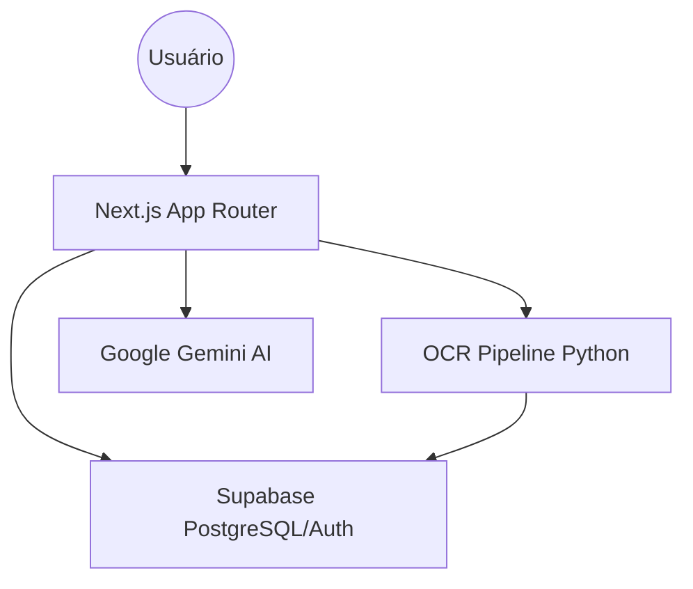

# CRMAPAXPRECATORIOS - Gestão Inteligente de Ativos Judiciais


O **CRMAPAXPRECATORIOS** é uma plataforma de alta performance para gestão de precatórios, unindo automação com IA, visibilidade de pipeline e cálculos financeiros precisos.

## 🏗 Arquitetura

O sistema é um **Monolito Full-Stack Moderno** construído em Next.js 15, com infraestrutura delegada ao Supabase e processamento especializado de IA via Pipeline Python.



## 📂 Estrutura de Pastas

```text
├── app/                  # Rotas, API e Dashboard
├── components/           # UI Components (HeroUI / Framer Motion)
├── services/             # Lógica de Negócio e APIs
├── lib/                  # Utilitários e Calculadoras
├── supabase/             # Banco de Dados (Migrations)
└── precatorio_ocr_pipeline/ # Pipeline de IA em Python
```

## 🚀 Como Rodar o Projeto

1. **Dependências:**
   ```bash
   npm install
   ```

2. **Variáveis de Ambiente:**
   Crie um `.env.local` seguindo o `.env.example`.

3. **Execução:**
   ```bash
   npm run dev
   ```

## 🛠 Principais Dependências
- **Frontend:** HeroUI, Framer Motion, Recharts, Lucide React.
- **Backend:** Supabase SSR, Gemini AI SDK.
- **Desktop:** Tauri Rust ecosystem.

## 📖 Exemplos de Uso
O sistema permite realizar o upload de um ofício precatório, onde a IA extrai automaticamente os dados, gerando um Kanban jurídico e permitindo a simulação imediata de valores de compra com base nos juros calculados.
