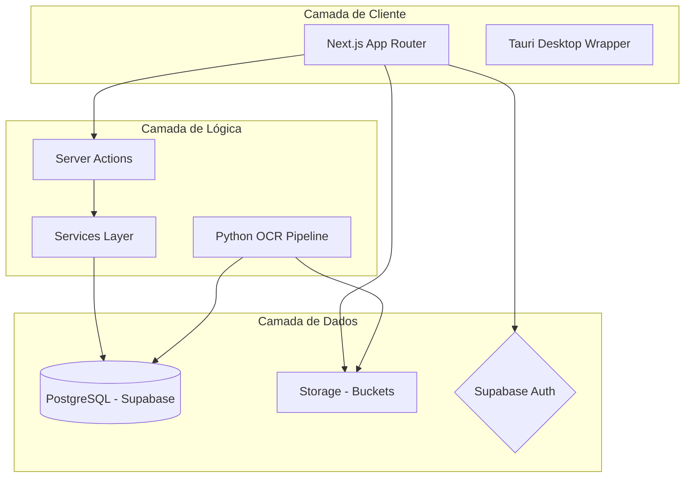
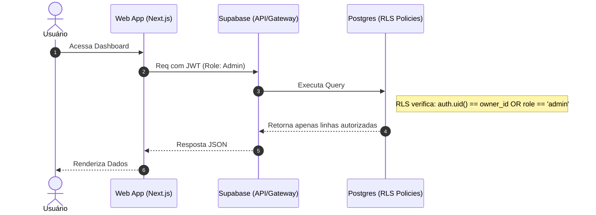
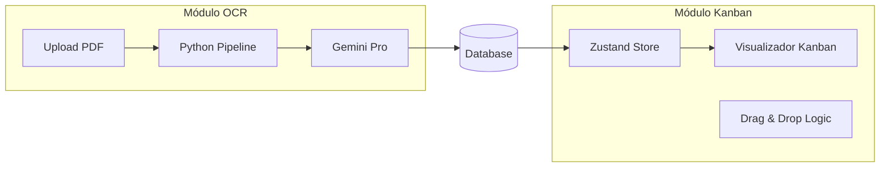

# Diagramas do Sistema - CRMAPAXPRECATORIOS

## 1. Arquitetura de Alto Nível
Este diagrama mostra como os principais blocos do sistema se interconectam.

---

## 2. Fluxo de Requisição e Segurança (RLS)
Demonstra o caminho de uma requisição autenticada.

---

## 3. Estrutura de Módulos (Kanban & OCR)
Detalha a interação entre os dois módulos mais complexos.

