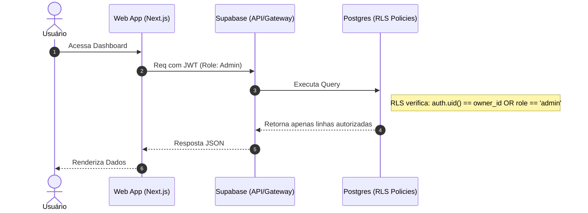
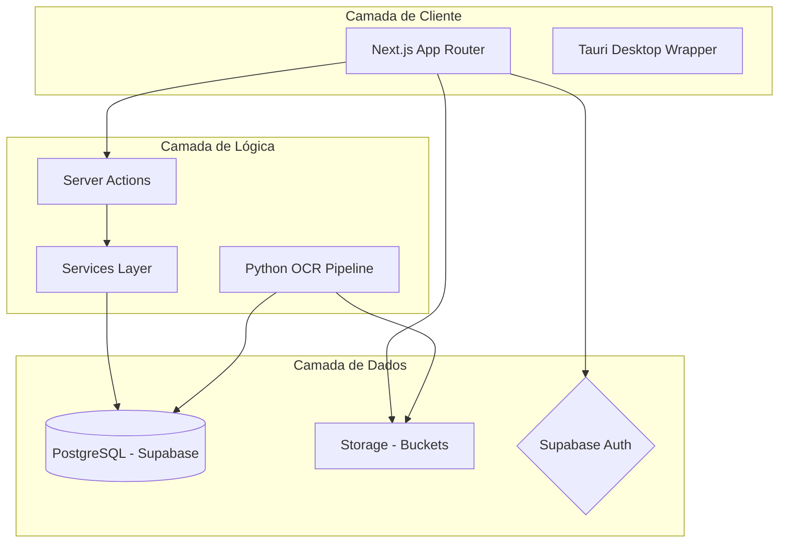

# Documentação Técnica Completa - CRMAPAXPRECATORIOS

Este documento consolida toda a arquitetura, fluxos, regras de negócio e detalhes técnicos do sistema de gestão de precatórios.

---

## 1. Visão Geral do Projeto

### Objetivo
O **CRMAPAXPRECATORIOS** é uma plataforma projetada para gerenciar o ciclo de vida completo de ativos judiciais (precatórios e créditos). Ele permite o controle administrativo, jurídico e financeiro, automatizando a extração de dados de documentos oficiais.

### Mercado e Problema
- **Automação:** Resolve a lentidão na extração de dados de ofícios judiciais via OCR alimentado por IA.
- **Gestão de Pipeline:** Organiza negociações através de quadros Kanban especializados para cada etapa do ativo.
- **Precisão:** Substitui planilhas manuais por calculadoras financeiras baseadas em regras oficiais de juros e mora.

### Público-Alvo
Escritórios de advocacia, fundos de investimento em ativos judiciais e administradoras de créditos.

---

## 2. Arquitetura do Sistema

O sistema segue um modelo **Full-stack Monolítico Moderno** com desacoplamento de infraestrutura.

- **Arquitetura:** Clean Architecture adaptada para o ecossistema Serverless/Next.js.
- **Frontend/Backend:** Next.js 15 unifica a UI (React) e a lógica de servidor (Server Actions / API Routes).
- **Dados:** Supabase (Backend-as-a-Service) provê PostgreSQL, Autenticação JWT e Storage.
- **Processamento de IA:** Pipeline Python isolado para OCR pesado, integrado via API.

---

## 3. Estrutura de Pastas e Responsabilidades

| Pasta | Descrição |
| :--- | :--- |
| `app/` | Roteamento, APIs e páginas do dashboard (App Router). |
| `components/` | UI Components (HeroUI, Shadcn e Kanban nativo). |
| `lib/` | Calculadoras financeiras, hooks e clientes de infraestrutura. |
| `services/` | Abstração de regras de negócio e chamadas externas (Market Data). |
| `supabase/` | Definições de banco de dados e migrações. |
| `precatorio_ocr_pipeline/` | Motor de inteligência em Python para documentos. |
| `src-tauri/` | Engine Rust para empacotamento desktop Windows. |

---

## 4. Regras de Negócio e Validações

1.  **Isolamento de Dados (RLS):** Garantia de que cada empresa acesse apenas seus próprios ativos e usuários.
2.  **Hierarquia de Permissões:**
    - **Admin:** Controle total do sistema e telemetria.
    - **Gestor:** Gerencia equipe e aprova negociações.
    - **Operador:** Executa cálculos e move ativos no Kanban.
3.  **Fluxo de Ativo:** Um precatório deve passar obrigatoriamente por validação documental antes de entrar na etapa de precificação.
4.  **Intecligência Financeira:** Cálculos de descontos (Haircut) e correção monetária (IPCA-E / SELIC) são aplicados dinamicamente.

---

## 5. Fluxo de Funcionamento (Dados)

---

## 6. Tecnologias Utilizadas

- **Linguagens:** TypeScript (90%), Python (OCR), Rust (Tauri), SQL (Migrations).
- **Frameworks:** Next.js 15 (React 19), Tailwind CSS 4, HeroUI v3.
- **Bibliotecas UI:** Framer Motion, GSAP, Lucide, Recharts.
- **IA:** Google Gemini Pro API.
- **Infra:** Supabase (Auth, DB, Storage).

---

## 7. Diagramas de Arquitetura

### Conectividade de Camadas

---

## 8. Banco de Dados (Entidades Principais)

- **`empresas`:** Tabela raiz para multi-tenancy.
- **`usuarios`:** Perfis com metadados de roles vinculados ao Supabase Auth.
- **`precatorios`:** Coração do sistema. Armazena valores, tribunais, datas e status do Kanban.
- **`telemetria`:** Logs de uso para auditoria e controle de performance.

---

## 9. Guia de Setup para Desenvolvedores

### Pré-requisitos
- Node.js 20+
- Python 3.10+ (para o pipeline OCR)
- Conta no Supabase

### Passos
1.  **Clone e Install:** `npm install`
2.  **Env:** Copie `.env.example` para `.env.local` e preencha as chaves.
3.  **Database:** `npx supabase db push` para aplicar migrações.
4.  **Dev:** `npm run dev`

### Scripts Úteis
- `npm run lint`: Verifica erros de código.
- `npm run tauri dev`: Inicia versão desktop.

---

## 10. Guia de Manutenção por Módulo

- **Alterar Regras de Cálculo:** Local: `lib/calculos/`.
- **Modificar UI do Kanban:** Local: `components/kanban/`.
- **Novas APIs:** Local: `app/api/`.
- **Evoluir Banco:** Local: `supabase/migrations/`.
